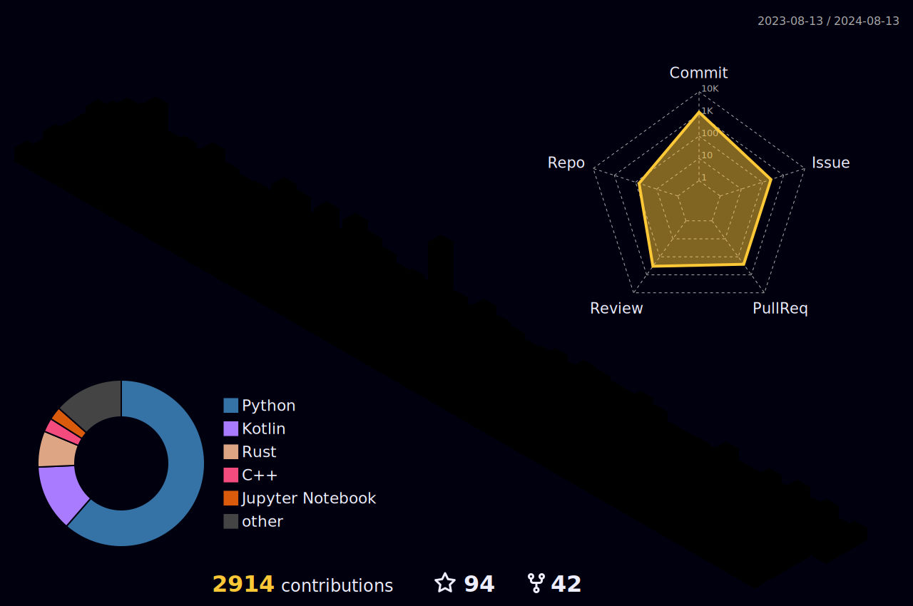

    

Greetings! I'm Muhammed, a seasoned Senior Software Engineer proficient in Python, C++, C#. My expertise lies in the captivating realms of AR, Machine Learning, Deep Learning, and Computer Vision. Engaging in extensive DevOps and MLOps practices further complements my skill set.

In addition to my diverse skill set, I am actively contributing to a computer vision project named Supervision. Supervision is dedicated to crafting reusable computer vision tools tailored to a wide array of needs. This project embodies my commitment to advancing the field of computer vision, offering robust solutions that empower developers and researchers alike.

I am also contributing various FLOSS and OSS projects around GitHub/Gitlab/Pagure and other platforms to make everyone and developers lives better.

 
 

  </img>
  </img>

Here is my Arsenal Tools and Skills I use;

<h3 align="left">Programming</h3>

    </img>
    </img>
    </img>
    </img>
    </img>
    </img>
    </img>
    </img>

<h3 align="left">Framework & Libraries</h3>

  </img>
  </img>
  </img>
  </img>
  </img>
  
   

<h3 align="left">Game Engines</h3>

    </img>

<h3 align="left">Databases</h3>

    
    
    

<h3 align="left">Virtualization Platforms</h3>

    

<h3 align="left">Software and tools</h3>

    
    
    <a href="#"></img></a>
    <a href="#"></img></a>
    <a href="#"></img></a>
    
    
    
    
    
    
    
    
    
    

<h3 align="left">Linux Distributions</h3>

    
    

<h3 align="left">Platforms</h3>

    
    

<h3 align="left">Cloud Providers</h3>

    
    

## Current project(s) I'm working/worked on

- [Supervision](https://github.com/roboflow/supervision)
- [Supervision Conda Forge](https://github.com/conda-forge/supervision-feedstock)
- [GFPGAN-ncnn-vulkan](https://github.com/onuralpszr/GFPGAN-ncnn-vulkan)
- [CvCamera-Mobile](https://github.com/onuralpszr/CvCamera-Mobile)
- [Sceneview-android](https://github.com/SceneView/sceneview-android)
- [Sceneform-android from Sceneview Team](https://github.com/SceneView/sceneform-android)
- [Nvidia Auto Installer](https://github.com/t0xic0der/nvidia-auto-installer-for-fedora)
- [Ultralytics](https://github.com/ultralytics/ultralytics)
- [Yolo-World](https://github.com/AILab-CVC/YOLO-World)

## Certifcations

- [Tensorflow Developer](https://www.credential.net/5d4c2d99-4c0b-4990-9399-2bdb496f7d4f#gs.axwujf)

